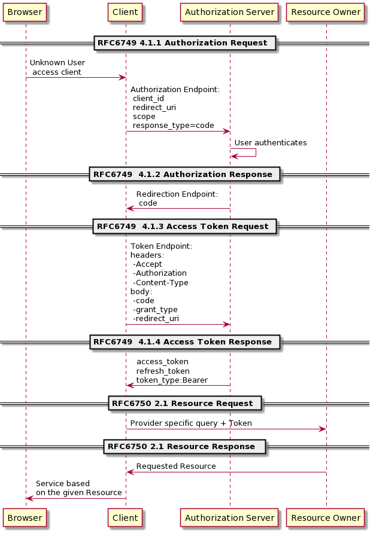

# [Node-RED](https://nodered.org/) Orchestrator

This repository provides a simple way to deploy Node-RED as web service providing:
- Multisession support. Node-RED does not support multisession. In order to provide it specific Node-RED servers are
  deployed for each user. 
- [OAuth 2.0](https://datatracker.ietf.org/doc/html/rfc6749) authorization. The users must log in in an authorization
  server before having access to a devoted Node-RED server.

## Structure

An [NginX](https://nginx.org/) [reverse proxy](https://en.wikipedia.org/wiki/Reverse_proxy) will distributed the
incomming request to each user-specific Node-RED server. It also provides HTTPS (WAN) to HTTP (LAN) conversion.

The [traffic-accounting-nginx-module](https://github.com/Lax/traffic-accounting-nginx-module) NginX extension is used
to monitorized the Node-RED servers traffic.

A [Node.js](https://nodejs.org) application called Orchestrator deals with Node-RED servers live management and autorization.
The authorization is provided by the [client-oauth2 module](https://www.npmjs.com/package/client-oauth2).
The user session management is based on cookies using the [cookie-session module](https://www.npmjs.com/package/cookie-session)
allowing session sharing between the orchestrator and Node-RED servers. 

## How it works

NginX uses a configuration file generated with nginx.conf.template replacing the *$eProsima{xxx}* values with actual
production values (NginX encourages the use of templates to generate config files).

| Syntax | Description | Example |
| ----------- | ----------- | --------- |
| certificates_root | folder where the certificates are kept | /home/orchestrator/certs |
| traffic_log_root | folder where the traffic monitoring log is kept  | /home/orchestrator/node_red_data |
| authorization_server_url | OAuth 2.0 Authorization Endpoint | https://www.googleapis.com |
| orchestrator_url | address of the local orchestrator  | http://localhost:1811 |

NginX config sets up a couple of virtual servers:
- One devoted to HTTPS WLAN requests. This is the one users will address from it's browsers. Its allocated port is 6338
  and should be open in the server firewall for inbound tcp traffic.
- Another devoted to HTTP LAN request. This one is used for authorization traffic. Its allocated port is 6339 and
  doesn't require any firewall set up.
 
## Authorization Flow

The authorization code method is selected from among all the available in OAuth 2.0. The HTTP message exchange is shown 
in the figure below:
- **Browser**: is the user application requesting a service from the **Client**.
- **Authorization Server**: is a web service devoted to user authentication and token distribution.
  The authorization server has a couple of public urls:
  - *Authorization Endpoint* to start the authorization exchange. For example: https://accounts.google.com/o/oauth2/v2/auth
  - *Token endpoint* to retrieve the authorization tokens once authentication is achieved or token expiration demands
    the use of a *refresh token*. For example: https://www.googleapis.com/oauth/token
- **Client**: is an intermediate application that requires access to user data stored in the **Resource Owner**.
  In this case the orchestrator acts as **Client** and the resource coveted is the username.
  This username is used to univocally identify the user in a session.
  The **Authorization Server** has a beforehand knowledge of the **Client** which can be summarized in:
  - client_id: unique identifier for the client.
  - client_secret: a password shared only between **Client** and **Authorization Server**.
  - redirect_uri: and uri specifying the *Redirection Endpoint*. Where the **Client** expects to receive the answers. 
    For example: https://client.eprosima.com/auth/callback
- **Resource Owner**: is a web service that provides user data if a suitable authentication token is provided. The API
  for data retrieval is server specific and should be documented. In this case the **Authorization Server** and the
  **Resource Owner** are same server. For example the API used to retrieve the username is:
  https://www.googleapis.com/api/userinfo

<!--
@startuml
participant Browser
participant Client
participant "Authorization Server" as AuthServer
participant "Resource Owner" as Owner

== RFC6749 4.1.1 Authorization Request ==

Browser->Client: Unknown User\n access client
Client->AuthServer: Authorization Endpoint:\n client_id\n redirect_uri\n scope\n response_type=code
AuthServer->AuthServer: User authenticates

== RFC6749  4.1.2 Authorization Response ==

AuthServer->Client: Redirection Endpoint:\n code

== RFC6749  4.1.3 Access Token Request ==

Client->AuthServer: Token Endpoint:\nheaders:\n -Accept\n -Authorization\n -Content-Type\nbody:\n -code\n -grant_type\n -redirect_uri

== RFC6749  4.1.4 Access Token Response ==

AuthServer->Client: access_token\nrefresh_token\ntoken_type:Bearer

== RFC6750 2.1 Resource Request ==

Client->Owner: Provider specific query + Token

== RFC6750 2.1 Resource Response  ==

Owner->Client: Requested Resource
Client->Browser: Service based\non the given Resource
@enduml
-->



The orchestrator is feed all this authorization related information from a *settings/settings.json* file. The following
example shows the expected structure:

```json
{
    "authorization":
    {
        "clientId":"eProsima",
        "clientSecret":"64ea052b-246f-4706-a1fc-5a47764973b3",
        "accessTokenUri":"http://localhost:6339/oauth/token",
        "authorizationUri":"https://accounts.google.com/o/oauth2/v2/auth",
        "redirectUri":"https://client.eprosima.com/auth/callback",
        "scopes":["*"]
    },
    "cookies":
    {
        "name":"eProsima_session",
        "keys":["3fb9b9e6-5183-4091-918a-c62a10535207"],
        "maxAge":86400000
    },
    "orchestrator_uri":"https://client.eprosima.com",
    "resource_api":"http://localhost:6339/api/userinfo",
    "node_red_secret":"da2b84b1-d39e-428d-86b8-e90af686a804",
    "log_file_path":"/home/orchestrator/node_red_data/traffic.log"
}
```

The cookies configuration is shared among the orchestrator and all Node-RED servers to allow data sharing of user
session data.
The *node_red_secret* is the key used to encript the Node-RED servers data.
The reason why *accessTokenUri* and *resource_api* reference the NginX inbound port (http://localhost:6339) instead of
the actual **Authorization-Resource Server** uri (https://www.googleapis.com) is to achieve HTTP->HTTPS translation
through NginX.

## Testing

In order to locally test this repo the following [example](https://github.com/awais786327/oauth2orize-examples) was
forked [here](https://github.com/MiguelBarro/oauth2orize-examples).
